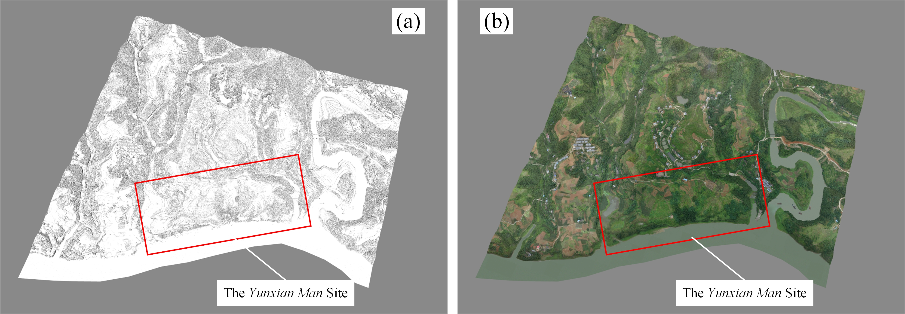

## Dynamically documenting archaeological excavations based on 3D modeling: a case study of the excavation of the #3 fossil of hominin cranium from Yunxian, Hubei, China. 
(Manuscript for Heritage Science 2024)

<!-- <p align="center">
  
</p> -->

**Author:** Wenyuan Niu, Chengqiu Lu, Qiushi Zou, Yunbing Luo, Xuan Wang, Hanyu Xiang, Fan Zhang, Xing Gao, Song Xing, Xuan Wei, Wentai Lou, Dailong Huang, Cheng Wang, Dongqing Jiang, Xiaofeng Wan, Zhongyun Zhang, Huanghao Yin, Jiayang Lu, Feng Wang, Xianfeng Huang*, Yinghua Li*.

(State Key Laboratory of Information Engineering in Surveying, Mapping and Remote Sensing, Wuhan University, China)


**Abstract**

Documenting tangible cultural heritage using 3D modeling techniques is gradually becoming an indispensable component of archaeological practice. The 3D modeling techniques based on photogrammetry and LiDAR scanning enable high-accuracy and high-realistic reconstruction of sites and ruins, and have been proven a powerful tool for documenting archaeological excavations. However, dynamically documenting an ongoing excavation using these techniques is still considered tedious, time-consuming, expensive, and dependent on expertise. In these senses, documenting the archaeological excavation at the Yunxian Man site (located in Hubei, China) is an invaluable opportunity for exploration and practice. Archaeologists determined to conduct dynamically documenting at the beginning of the 6th excavation project for the site, and established a rotation system to reconcile physical excavation with digital preservation. Through repeated practice and communication, we proposed a workflow and pursued several new methods to enhance the feasibility of dynamically documenting, and obtained multi-temporal 3D models of the ongoing archaeological excavations. In 2022, the Yunxian Man site unearthed the most intact fossil of hominin cranium from about one million years ago in the Eurasian continent, preserving important and scarce anatomical features of early humans in Asia. As the original taphonomic context of the fossil corroded away during physical excavations, the digital documentation consisting of multi-temporal 3D models serves as permanent original data source in subsequent archaeological research. Moreover, we obtained cross-scale 3D models from geographical environment to archaeological site, excavation area, and cultural remains, and all of these 3D models are in an actual, unified coordinate framework. Thus, we can contribute to multidisciplinary cross-collaborative research through data sharing. Considering that digital documentations serve a great value in archaeological research, this paper focuses on sharing the workflow and methods to facilitate digital preservation for more archaeological projects.

**What does this repository cover??**

This repository provides a concrete implementation of the evaluation metrics in our paper (Section 2.7), as the relevant functions have not yet been added to our software.

**Sample Data**

The sample data is used to test the evaluation metrics and reproduce the results in Table 5 in the paper, where the IDs are in bold font. Click here [sample data (about 3.26GB)](https://drive.google.com/drive/folders/1q2z18tTiqOzJB4oIOSLvL0ooDaApAhHm?usp=sharing) to download the example data.

The example data is organized as follows:
```
Level1_Geographical_Environment
├── Level1_Geographical_Environment
│   ├── Model.obj (model file)
│   ├── Model.mtl (material library file)
│   ├── Model.wrp (A copy of the model that can be quickly opened in Geomagic Warp)
│   ├── Tile_+003_+016_texture_1.jpg (texture image files)
│   └── ...
├── Level2_Archaeological_Site
│   ├── Model.obj
.   ├── Model.mtl
.   ├── Model.wrp
.   ├── Tile_+024_+018_1.JPG
    └── ...
├── ...
```

Although the example data is partial and localized, it demonstrates our ability to perform the core function mentioned in the paper --- 3D documenting for the multi-level archaeological excavation areas.

**How to get other functions??**

Other software functions mentioned in the paper are already available as software products. You can get the links from Table 1 in the paper or visit the [homepage](https://wyniu.github.io/DDAE/) of this project.

## 🚀 Steps to Get Started
Follow instructions below.

### Step 1: Compute geometric refinement
(1) Install Matlab and download the data and code. 

(2) Set the variable path and res_file in geometric_refinement_compute.m, and run it to get a txt file that records information about geometric refinement.

### Step 2: Compute texture refinement
(1) Prepare the OBJ format file of the 3D model to be evaluated, which normally consists of one model file (.obj), one material library file (.mtl), and several texture image files (.png or .jpg).

(2) Open one of the texture images with image processing software. Randomly select a texture block and draw a straight line $T_i$ within it, record the pixel number $N_i$ of $T_i$, and save the changed image.

(3) Open the 3D model with a 3D viewer, find $T_i$, and measure its length, recording the length value in millimeter as $L_i$.

(4) The texture resolution $R_i$ at the location of $T_i$ is calculated as the ratio of $N_i$ to $L_i$. Randomly repeated $n_3$ times, calculating the average value $R_t$ of all the $R_i$, then $R_t$ represent the texture resolution of the 3D model (Equation 3 in paper).


<!-- ## Citation

If you find this repository useful, please consider citing this paper (please note that this paper is still under review):

```bibtex
@article{WenyuanNIU2024HeritageScience,
  title={Dynamically documenting archaeological excavations based on 3D modeling: a case study of the excavation of the #3 fossil of hominin cranium from Yunxian, Hubei, China.},
  author={Wenyuan Niu and Chengqiu Lu and Qiushi Zou and Yunbing Luo and Xuan Wang and Hanyu Xiang and Fan Zhang and Xing Gao and Song Xing and Xuan Wei and Wentai Lou and Dailong Huang and Cheng Wang and Dongqing Jiang and Xiaofeng Wan and Zhongyun Zhang and Huanghao Yin and Jiayang Lu and Feng Wang and Xianfeng Huang* and Yinghua Li*},
  journal={Heritage Science},
  volume={},
  pages={},
  year={2024},
  publisher={Springer}
  link={}
  doi={}
} -->